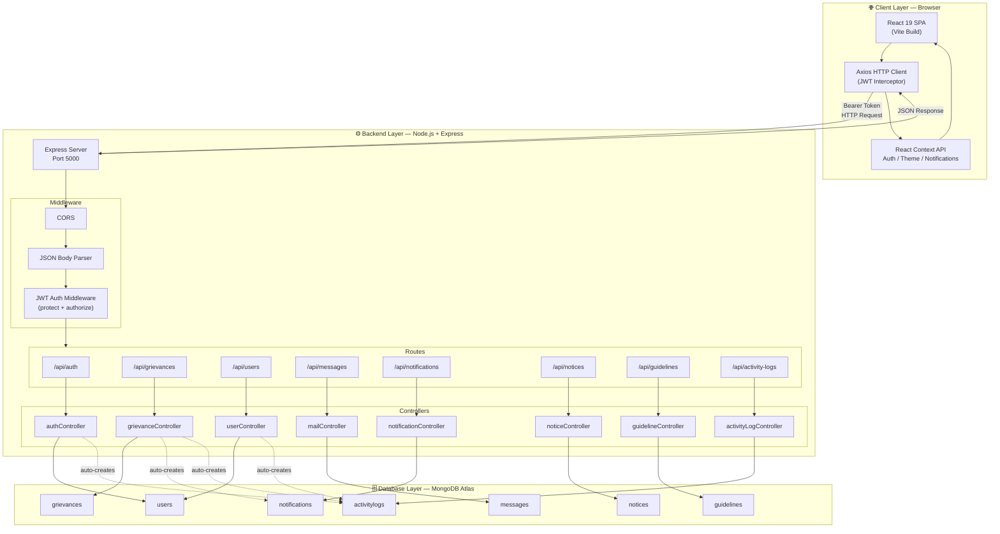
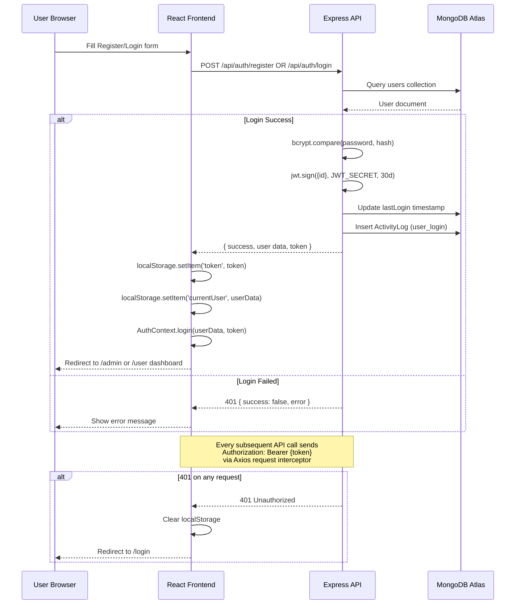
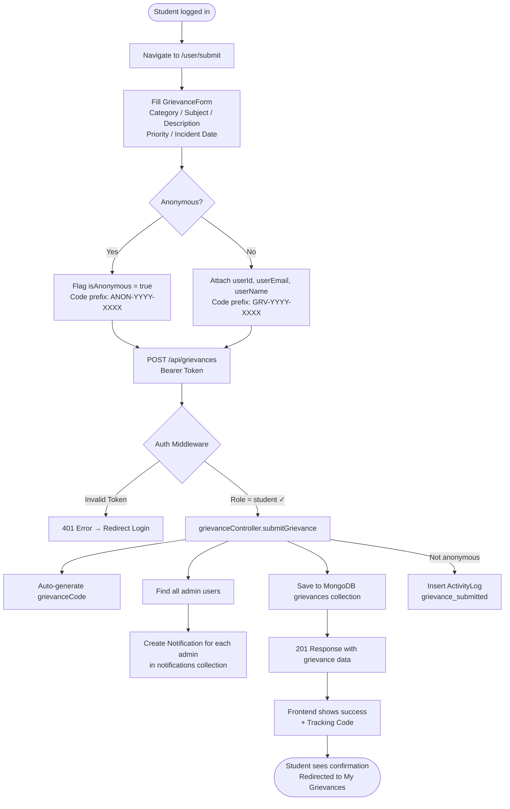
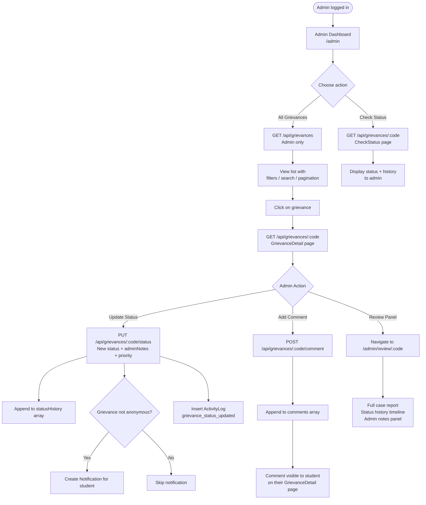
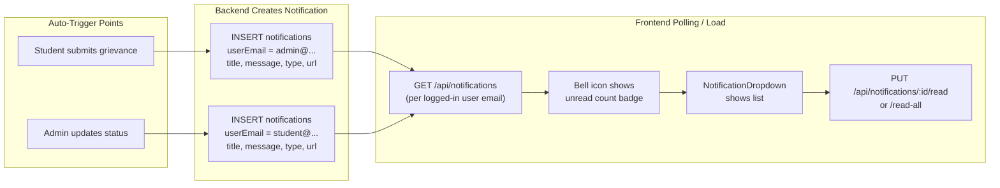
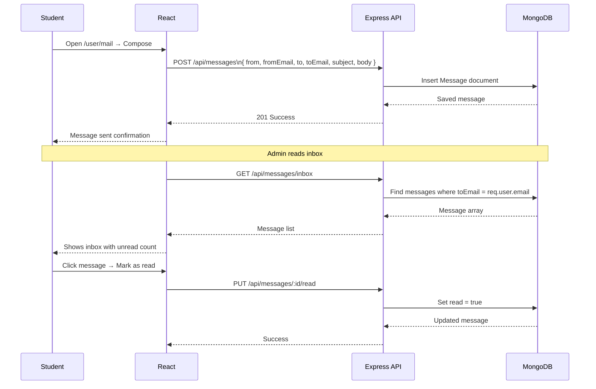
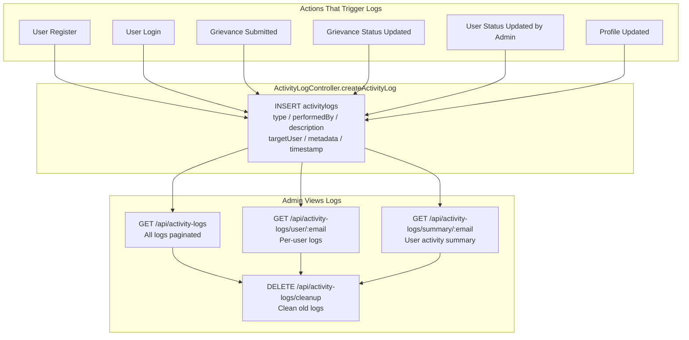
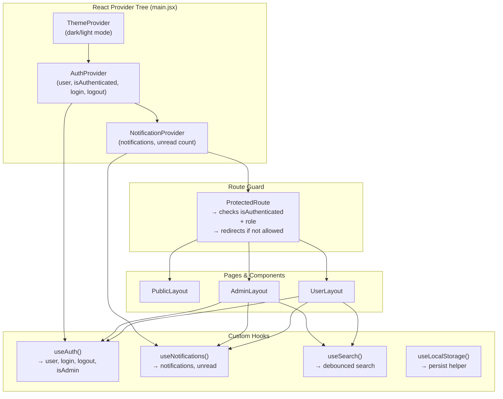
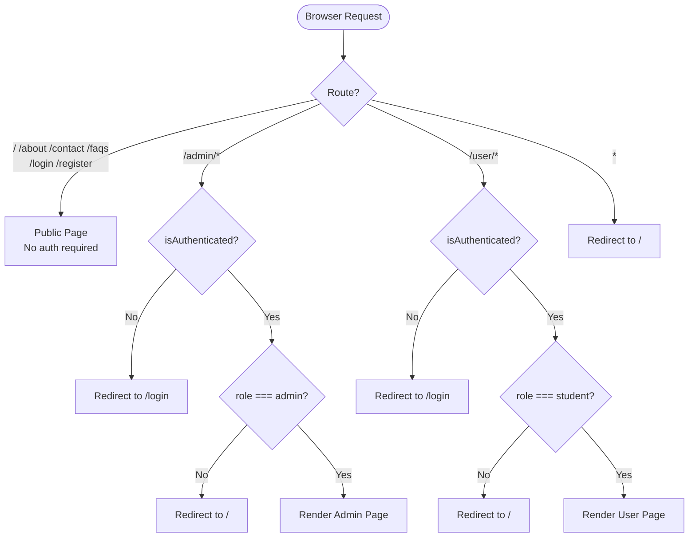
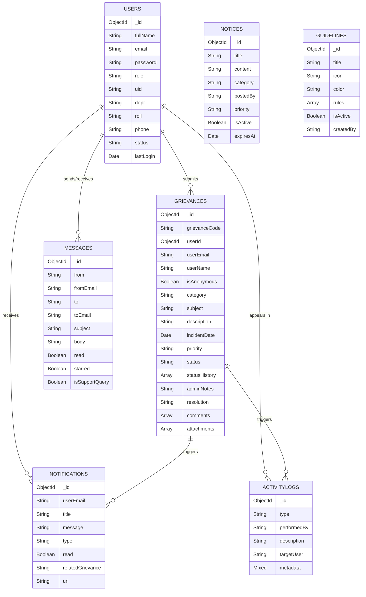

# CodeFlow — System Flow Diagrams

> **Project**: CodeFlow — Digital Complaint & Grievance Analytics System  
> **Version**: 1.0 (Full Stack — React + Node.js + MongoDB Atlas)  
> **Date**: March 8, 2026  
> **Status**: ✅ Complete and Production-Ready

This document contains comprehensive flow diagrams showing how different sections of the CodeFlow grievance management system work and interact with each other.

## Table of Contents
1. [Overall System Architecture Flow](#1-overall-system-architecture-flow)
2. [Authentication System Flow](#2-authentication-system-flow)
3. [Grievance Submission Flow](#3-grievance-submission-flow)
4. [Admin Grievance Review Flow](#4-admin-grievance-review-flow)
5. [Notification Flow](#5-notification-flow)
6. [Internal Mail System Flow](#6-internal-mail-system-flow)
7. [Activity Log Flow](#7-activity-log-flow)
8. [Frontend Context & State Management](#8-frontend-context--state-management)
9. [Role-Based Route Access Flow](#9-role-based-route-access-flow)
10. [Data Persistence Model](#10-data-persistence-model)

---

## 1. Overall System Architecture Flow

---

## 2. Authentication System Flow

---

## 3. Grievance Submission Flow

---

## 4. Admin Grievance Review Flow

---

## 5. Notification Flow

---

## 6. Internal Mail System Flow

---

## 7. Activity Log Flow

---

## 8. Frontend Context & State Management

---

## 9. Role-Based Route Access Flow

---

## 10. Data Persistence Model

