# Code Flow - System Flow Diagrams

This document contains comprehensive flow diagrams showing how different sections of the Code Flow grievance management system work and interact with each other.

## Table of Contents
1. [Complete System Overview](#1-complete-system-overview)
2. [User Authentication Flow](#2-user-authentication-flow)
3. [Student Grievance Submission Flow](#3-student-grievance-submission-flow)
4. [Admin Grievance Review Flow](#4-admin-grievance-review-flow)
5. [Notification System Flow](#5-notification-system-flow)
6. [Mail Communication Flow](#6-mail-communication-flow)
7. [Data Storage Architecture](#7-data-storage-architecture)
8. [Component Interaction Flow](#8-component-interaction-flow)

---

## 1. Complete System Overview

This diagram shows all major sections and how they connect:


**What this shows:**
- Three user types: Guest, Student, Admin
- Public pages accessible to everyone
- Student dashboard with 9 main features
- Admin dashboard with 9 management features
- Service layer handling business logic
- Context providers managing global state
- localStorage as the data persistence layer

---

## 2. User Authentication Flow

Shows how users register, login, and access protected routes:


**Key Points:**
- AuthContext checks localStorage on app load
- Registration creates user in `users` array
- Login creates session with `currentUser` and `authToken`
- Role-based routing to Student or Admin dashboard
- Logout preserves grievance data, only clears session

---

## 3. Student Grievance Submission Flow

Complete flow from submission to tracking:


**What Happens:**
1. Student fills form with category, subject, description
2. Chooses anonymous or identified submission
3. System generates unique tracking code
4. Grievance saved to appropriate database
5. Admin receives notification
6. Student gets tracking code for future reference

---


## 4. Admin Grievance Review Flow

How admins review and update grievances:


**Admin Workflow:**
1. View dashboard with statistics
2. Browse grievances (all, by category, or search)
3. Click on grievance to see full details
4. Open review page to update status/priority
5. Add admin notes and review comments
6. Save changes - updates database and history
7. Student receives notification of status change

---

## 5. Notification System Flow

How notifications are created and displayed:

```mermaid
flowchart TD
    subgraph Events["📢 Notification Triggers"]
        E1[Student Submits Grievance]
        E2[Admin Updates Status]
        E3[New Notice Posted]
        E4[New Guideline Added]
        E5[New Mail Received]
    end
    
    subgraph Creation["🔔 Notification Creation"]
        E1 --> CREATE_ADMIN[Create Admin Notification]
        E2 --> CREATE_STUDENT[Create Student Notification]
        E3 --> CREATE_ALL[Create Notification for All]
        E4 --> CREATE_ALL
        E5 --> CREATE_RECIPIENT[Create Recipient Notification]
        
        CREATE_ADMIN --> ADMIN_NOTIF[Notification Object:<br/>- title<br/>- message<br/>- type<br/>- grievanceCode<br/>- url<br/>- read: false<br/>- time]
        
        CREATE_STUDENT --> STUDENT_NOTIF[Notification Object:<br/>- title<br/>- message<br/>- type<br/>- grievanceCode<br/>- url<br/>- read: false<br/>- time]
        
        CREATE_ALL --> ALL_NOTIF[Notification Object]
        CREATE_RECIPIENT --> RECIP_NOTIF[Notification Object]
    end
    
    subgraph Storage["💾 Storage"]
        ADMIN_NOTIF --> SAVE_ADMIN[Save to<br/>notifications_admin@email]
        STUDENT_NOTIF --> SAVE_STUDENT[Save to<br/>notifications_student@email]
        ALL_NOTIF --> SAVE_ALL[Save to all user<br/>notification arrays]
        RECIP_NOTIF --> SAVE_RECIP[Save to recipient<br/>notification array]
    end
    
    subgraph Display["📱 Display"]
        SAVE_ADMIN --> LOAD[NotificationContext Loads]
        SAVE_STUDENT --> LOAD
        SAVE_ALL --> LOAD
        SAVE_RECIP --> LOAD
        
        LOAD --> COUNT[Count Unread]
        COUNT --> BADGE[Update Badge Number]
        
        BADGE --> USER_CLICK{User Clicks<br/>Notification Icon}
        
        USER_CLICK -->|Yes| DROPDOWN[Show Notification Dropdown]
        DROPDOWN --> LIST[Display Notification List]
        
        LIST --> CLICK_NOTIF{Click Notification}
        CLICK_NOTIF -->|Yes| MARK_READ[Mark as Read]
        MARK_READ --> NAVIGATE[Navigate to URL]
        NAVIGATE --> PAGE[Open Related Page]
        
        CLICK_NOTIF -->|No| CLOSE[Close Dropdown]
    end
    
    style Events fill:#e3f2fd
    style Creation fill:#fff9c4
    style Storage fill:#ffccbc
    style Display fill:#c8e6c9
```



**Notification Flow:**
1. **Trigger**: Event occurs (submission, update, new notice, etc.)
2. **Creation**: System creates notification object with details
3. **Storage**: Saved to user-specific localStorage key
4. **Display**: NotificationContext loads and counts unread
5. **Badge**: Shows unread count on notification icon
6. **Interaction**: User clicks to view, mark as read, and navigate

---

## 6. Mail Communication Flow

Internal messaging between students and admins:


**Mail System:**
- Students can send mail to admin
- Admins can send mail to specific students
- Admins can reply to student mails
- All mails stored in `mailDatabase`
- Recipients get notifications
- Read/unread status tracking

---


## 7. Data Storage Architecture

Complete localStorage structure and relationships:

```mermaid
flowchart TB
    subgraph LocalStorage["💾 localStorage"]
        subgraph Auth["🔐 Authentication"]
            USERS[users<br/>Array of all registered users]
            CURRENT[currentUser<br/>Active session user object]
            TOKEN[authToken<br/>Session token]
            LOGIN_TIME[loginTime<br/>Login timestamp]
        end
        
        subgraph Grievances["📋 Grievances"]
            GRIEV_DB[grievanceDatabase<br/>Object with category keys:<br/>- academic<br/>- hostel<br/>- infrastructure<br/>- harassment<br/>- other]
            ANON_DB[anonGrievances<br/>Array of anonymous grievances]
            CHECK_DB[checkStatusGrievances<br/>Array for quick status lookup]
            RECENT[recentGrievance<br/>Last submitted grievance]
        end
        
        subgraph Communication["💬 Communication"]
            MAIL_DB[mailDatabase<br/>Array of all mails]
            NOTIF[notifications_email<br/>Per-user notification arrays]
        end
        
        subgraph Content["📰 Content"]
            NOTICES[notices<br/>Array of notice board posts]
            ADMIN_NOTICES[admin_notices<br/>Admin-specific notices]
            GUIDELINES[guidelines<br/>Array of guideline documents]
            GUIDE_DB[guidelines_db<br/>Alternative guideline storage]
        end
    end
    
    subgraph Operations["⚙️ Operations"]
        AUTH_OPS[Authentication Operations:<br/>- Register: Add to users<br/>- Login: Set currentUser & token<br/>- Logout: Clear session, keep data<br/>- Update: Modify currentUser & users]
        
        GRIEV_OPS[Grievance Operations:<br/>- Submit: Add to grievanceDatabase or anonGrievances<br/>- Update: Modify in database, add to history<br/>- Search: Query by code in checkStatusGrievances<br/>- Stats: Aggregate from all databases]
        
        MAIL_OPS[Mail Operations:<br/>- Send: Add to mailDatabase<br/>- Read: Mark as read<br/>- List: Filter by sender/recipient]
        
        NOTIF_OPS[Notification Operations:<br/>- Create: Add to notifications_email<br/>- Read: Mark notification as read<br/>- Count: Count unread notifications<br/>- Clear: Remove old notifications]
        
        CONTENT_OPS[Content Operations:<br/>- Create: Add to notices/guidelines<br/>- Update: Modify existing entry<br/>- Delete: Remove from array<br/>- Publish: Make visible to users]
    end
    
    Auth --> AUTH_OPS
    Grievances --> GRIEV_OPS
    Communication --> MAIL_OPS
    Communication --> NOTIF_OPS
    Content --> CONTENT_OPS
    
    subgraph DataFlow["🔄 Data Flow"]
        GRIEV_OPS -.->|Creates| NOTIF_OPS
        MAIL_OPS -.->|Creates| NOTIF_OPS
        CONTENT_OPS -.->|Creates| NOTIF_OPS
        AUTH_OPS -.->|Validates| GRIEV_OPS
        AUTH_OPS -.->|Validates| MAIL_OPS
    end
    
    style Auth fill:#e3f2fd
    style Grievances fill:#fff9c4
    style Communication fill:#c8e6c9
    style Content fill:#f3e5f5
    style Operations fill:#ffccbc
```



**Storage Structure:**

### Authentication Keys
- `users` - All registered users (array)
- `currentUser` - Active session user (object)
- `authToken` - Session token (string)
- `loginTime` - Login timestamp (ISO string)

### Grievance Keys
- `grievanceDatabase` - Organized by category (object)
  ```json
  {
    "academic": [...],
    "hostel": [...],
    "infrastructure": [...],
    "harassment": [...],
    "other": [...]
  }
  ```
- `anonGrievances` - Anonymous submissions (array)
- `checkStatusGrievances` - Quick lookup (array)
- `recentGrievance` - Last submission (object)

### Communication Keys
- `mailDatabase` - All mails (array)
- `notifications_<email>` - Per-user notifications (array)

### Content Keys
- `notices` - Notice board posts (array)
- `admin_notices` - Admin notices (array)
- `guidelines` - Guidelines (array)
- `guidelines_db` - Alternative storage (array)

---

## 8. Component Interaction Flow

How React components interact with services and contexts:

```mermaid
flowchart TB
    subgraph UI["🎨 UI Components"]
        PAGE[Page Component<br/>e.g., GrievanceForm]
        COMMON[Common Components<br/>Button, Card, Modal]
        LAYOUT[Layout Component<br/>UserLayout/AdminLayout]
    end
    
    subgraph Contexts["🔄 Context Providers"]
        AUTH_CTX[AuthContext<br/>- user<br/>- isAuthenticated<br/>- login/logout<br/>- updateUser]
        
        NOTIF_CTX[NotificationContext<br/>- notifications<br/>- unreadCount<br/>- markAsRead<br/>- clearAll]
        
        THEME_CTX[ThemeContext<br/>- theme<br/>- toggleTheme]
    end
    
    subgraph Hooks["🪝 Custom Hooks"]
        USE_AUTH[useAuth<br/>Access AuthContext]
        USE_NOTIF[useNotifications<br/>Access NotificationContext]
        USE_STORAGE[useLocalStorage<br/>localStorage helper]
        USE_SEARCH[useSearch<br/>Search functionality]
    end
    
    subgraph Services["⚙️ Services"]
        AUTH_SRV[authService<br/>- login<br/>- register<br/>- validateToken]
        
        GRIEV_SRV[grievanceService<br/>- submitGrievance<br/>- getUserGrievances<br/>- getGrievanceByCode<br/>- updateStatus<br/>- getStatistics]
        
        USER_SRV[userService<br/>- updateProfile<br/>- getUserActivity]
        
        MAIL_SRV[mailService<br/>- sendMail<br/>- getMails<br/>- markAsRead]
        
        GUIDE_SRV[guidelineService<br/>- getGuidelines<br/>- createGuideline<br/>- updateGuideline]
    end
    
    subgraph Storage["💾 Storage"]
        LS[(localStorage)]
    end
    
    PAGE --> USE_AUTH
    PAGE --> USE_NOTIF
    PAGE --> USE_STORAGE
    PAGE --> USE_SEARCH
    
    USE_AUTH --> AUTH_CTX
    USE_NOTIF --> NOTIF_CTX
    
    PAGE --> COMMON
    LAYOUT --> PAGE
    LAYOUT --> AUTH_CTX
    LAYOUT --> THEME_CTX
    
    PAGE --> Services
    
    AUTH_SRV --> AUTH_CTX
    GRIEV_SRV --> NOTIF_CTX
    MAIL_SRV --> NOTIF_CTX
    
    Services --> LS
    Contexts --> LS
    USE_STORAGE --> LS
    
    LS -.->|Read on mount| Contexts
    Contexts -.->|Provide state| PAGE
    Services -.->|Return data| PAGE
    PAGE -.->|Render| COMMON
    
    style UI fill:#e3f2fd
    style Contexts fill:#fff9c4
    style Hooks fill:#c8e6c9
    style Services fill:#f3e5f5
    style Storage fill:#ffccbc
```



**Component Interaction:**

1. **Page Component** (e.g., GrievanceForm)
   - Uses custom hooks to access contexts
   - Calls service functions for data operations
   - Renders common components

2. **Custom Hooks**
   - `useAuth` - Access user state and auth functions
   - `useNotifications` - Access notifications
   - `useLocalStorage` - Direct localStorage access
   - `useSearch` - Search and filter functionality

3. **Context Providers**
   - Wrap entire app in App.jsx
   - Provide global state to all components
   - Update when localStorage changes

4. **Services**
   - Handle business logic
   - Interact with localStorage
   - Return promises (simulating API calls)
   - Trigger context updates

5. **Data Flow**
   - User interacts with Page Component
   - Component calls Service function
   - Service updates localStorage
   - Service updates Context (if needed)
   - Context notifies subscribed components
   - Components re-render with new data

---

## 9. Complete User Journey Map

End-to-end journey for both student and admin:


**Complete Journey:**

### Student Path:
1. Register/Login → Student Dashboard
2. Submit grievance → Get tracking code
3. View submitted grievances
4. Track status updates
5. Receive notifications when admin updates
6. Communicate via mail
7. View notices and guidelines
8. Check personal analytics

### Admin Path:
1. Login → Admin Dashboard
2. View all grievances with statistics
3. Filter by category, status, date
4. Select and review grievance
5. Update status, priority, add notes
6. Student receives notification
7. Manage mail communication
8. Publish notices and guidelines
9. Monitor user activity
10. View system-wide analytics

---

## 10. Service Layer Detailed Flow

How each service interacts with data:


---

## Summary

This document provides comprehensive flow diagrams showing:

1. **System Overview** - All sections and their connections
2. **Authentication** - Registration, login, and session management
3. **Grievance Submission** - Complete student submission flow
4. **Admin Review** - How admins process grievances
5. **Notifications** - Creation, storage, and display
6. **Mail System** - Internal communication flow
7. **Data Storage** - localStorage structure and operations
8. **Component Interaction** - React components, hooks, contexts, and services
9. **User Journey** - End-to-end paths for students and admins
10. **Service Layer** - Detailed service function flows

These diagrams can be used for:
- Understanding system architecture
- Onboarding new team members
- Documentation for faculty review
- Planning future enhancements
- Debugging and troubleshooting

---

**Note**: All diagrams use Mermaid syntax and will render properly in GitHub, VS Code with Mermaid extension, or any Markdown viewer that supports Mermaid diagrams.
